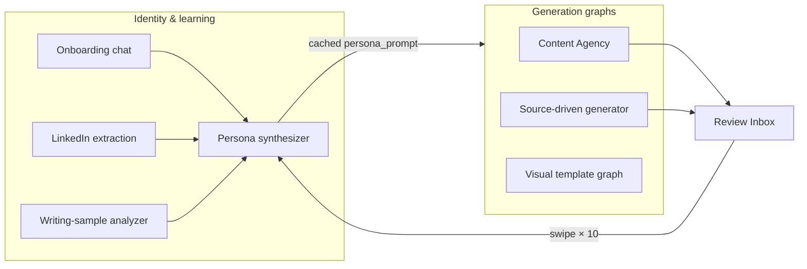
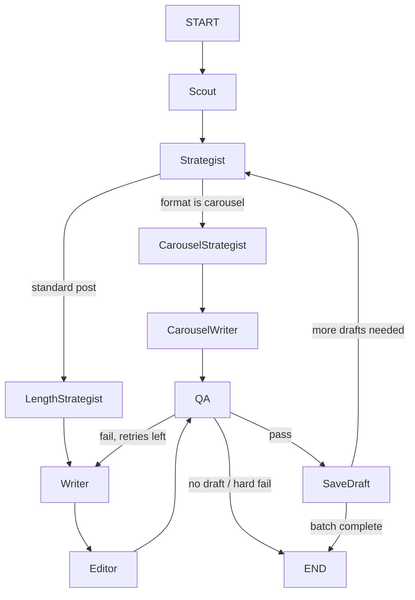
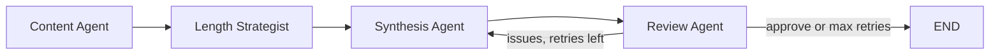
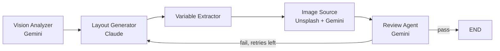
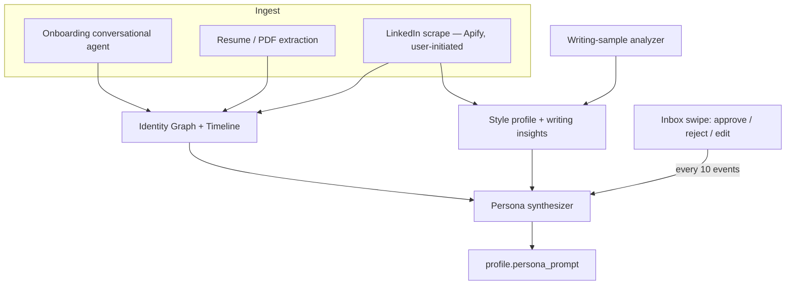

# Pixo

**Agentic personal branding for LinkedIn and Twitter/X.**

Pixo turns the 60-minute daily grind of “what should I post?” into a 5-minute **Review & Approve** workflow. Background AI agents learn who you are, how you write, and what is happening in your industry — then fill an inbox with ready-to-post drafts. You swipe, edit, and ship.

[Features](#features) · [Architecture](#architecture) · [Agentic workflows](#agentic-workflow-architecture) · [Tech stack](#tech-stack) · [Getting started](#getting-started) · [API](#api-overview)

---

## Why Pixo

Most LinkedIn tools are **toolboxes**. You open them, pick a template, paste a topic, and generate. The blank page is still your problem.

Pixo is **agent-first**. Agents work in the background so the product opens with work already done:

| | Typical tools | Pixo |
|---|---|---|
| Your role | Creator — search, pick, generate | Curator — review, edit, approve |
| Daily start | Blank page | Inbox of drafts in your voice |
| Style setup | Paste writing samples by hand | Learned from LinkedIn, resume, website, posts |
| Feedback | One-off generation | Every swipe trains the next draft |
| Effort | 30–60 min/day | 5–10 min/day |

It supports **individuals** (founders, operators, creators) and **enterprise profiles** (company + team workspaces with owner/member roles).

---

## Features

### Identity & onboarding

- **Unified Identity Graph** — role, industry, expertise, beliefs, stories, content pillars, authority angles, narrative themes
- **Career timeline** — education, work, pivots, achievements, with emotional core and lessons learned
- **Style profile** — tone sliders (formal/casual, technical/simple, serious/playful, humble/confident), format weights, taboo topics, preferred hooks
- **Persona prompt** — identity + style synthesized into a cached “ghostwriter bible” used by every generator
- **Onboarding** — LinkedIn URL (Apify), resume upload (PDF/DOCX), guided chat, writing-sample analysis
- **Completeness scoring** — tracks how rich the identity graph is so generation quality is predictable

### Content generation

Generate posts from multiple sources, all routed through multi-agent LangGraph pipelines:

| Mode | Input |
|---|---|
| Scratch | Topic, goal, key points |
| YouTube | Video URL → transcript → post |
| Article | URL → extracted article → post |
| PDF | Uploaded document |
| Audio | Recording or upload |
| Format | Goal-driven format (thought leadership, educate, inspire, etc.) |
| Agency | Autonomous batch: Scout → Strategist → Writer → Editor → QA |

Goals map to template categories via `GoalMapper` (thought leadership, engagement, educate, inspire, share experience, promote).

### Review & pipeline

- **Review Inbox** — swipe right to approve, left to reject, up to edit. Desktop has button fallbacks
- **Content Pipeline** — kanban for Approved / Scheduled / Published
- **Feedback loop** — swipe events update learned preferences and style weights
- **Live post preview** in the draft editor

### Templates & rich media

- **Content templates** — `{placeholder}` variables, categories, matching, community contributions with admin review
- **Visual templates** — HTML/CSS system templates and Fabric.js user-built canvases
- **Image templates** — quote cards, stats, announcements; rendered and stored on S3
- **Carousel templates** — multi-slide layouts with per-slide schemas (`draft_slides`, `slide_templates`)
- **Template-from-image** — upload a design → Vision Analyzer → Layout Generator → Unsplash / Gemini image fill
- **AI image generation** — Gemini native image gen (Nano Banana / Gemini 2.5 Flash Image), style-aware
- **Unsplash** — stock placeholders for visual templates

### Workspaces & product surface

- Multi-tenant **profiles** (individual or enterprise) with **members and invitations**
- **Analytics** — approval rate, topic performance, format performance, weekly digest
- **RSS feeds** per profile for opportunity scanning
- Marketing site: landing, features, use cases, blog, help, legal pages

### Not built yet

Honest status so contributors know where to plug in:

- Social publishing (LinkedIn / X APIs) and calendar auto-post
- Billing, plans, and word-count metering
- Auto first-comment after publish
- Engage & Grow (mentions, replies, social CRM)

---

## Architecture

```
┌─────────────────────────────────────────────────────────────────┐
│                         apps/web                                │
│   Next.js 14 App Router · TypeScript · Zustand · shadcn/ui     │
│   Landing site + authenticated dashboard                        │
└──────────────────────────────┬──────────────────────────────────┘
                               │ REST  /api/v1  (JWT)
┌──────────────────────────────▼──────────────────────────────────┐
│                         apps/api                                │
│   FastAPI · SQLAlchemy async · Pydantic · Alembic               │
│                                                                 │
│   LangGraph agents          LLM providers                       │
│   ├─ Content Agency         ├─ Gemini (Vertex AI) — primary     │
│   ├─ Multi-agent generator  └─ Claude (AWS Bedrock) — complex   │
│   └─ Template gen graph                                         │
│                                                                 │
│   Celery tasks ── Redis ── Beat (Postgres-backed schedule)      │
└───────┬───────────────────────────────┬─────────────────────────┘
        │                               │
        ▼                               ▼
 PostgreSQL + pgvector              AWS S3
 (Supabase-compatible)              (ap-south-1)
        │
        └─ Optional: Cloudflare Worker (YouTube transcripts)
                     Apify (LinkedIn public profile)
                     Unsplash (stock photos)
```

### Request path

1. The Next.js app calls FastAPI through `apiClient` (`apps/web/src/lib/api/`). Auth is a JWT stored in `localStorage`.
2. Every profile-scoped endpoint uses `get_profile_with_access()` — never `Profile.user_id == current_user.id` — so owner and invited members both work.
3. Generation endpoints enqueue or run LangGraph graphs. Long jobs go through **Celery + Redis**.
4. Media (uploads, rendered cards, generated images) lands in **S3**. Drafts, identity, templates, and swipe events live in **Postgres**.

### Multi-tenancy

A **Profile** is the workspace. `profile_members` holds Owner / Member roles and invitation state. Users can own multiple profiles (personal brand + company) and switch between them in the dashboard.

---

## Tech stack

### Frontend (`apps/web`)

| Layer | Choice |
|---|---|
| Framework | Next.js 14 (App Router) |
| Language | TypeScript |
| UI | Tailwind CSS, shadcn/ui (Radix primitives), Lucide icons |
| Motion | Framer Motion |
| State | Zustand (`auth-store`, `profile-store`) |
| Forms | React Hook Form + Zod |
| HTTP | Axios `apiClient` |
| Canvas / visuals | Fabric.js, d3 |
| Charts | Recharts |
| DnD | @dnd-kit |
| Markdown | react-markdown, gray-matter (blog) |

### Backend (`apps/api`)

| Layer | Choice |
|---|---|
| Framework | FastAPI + Uvicorn / Gunicorn |
| Language | Python 3.11 |
| ORM | SQLAlchemy 2 async + asyncpg |
| Migrations | Alembic |
| Validation | Pydantic v2 / pydantic-settings |
| Auth | JWT (`python-jose`), bcrypt, 24h expiry |
| Queue | Celery + Redis (`sqlalchemy-celery-beat`) |
| Vectors | pgvector |
| Docs | PyPDF, PyMuPDF, python-docx |
| HTTP | httpx, aiohttp, BeautifulSoup, feedparser |
| Storage | aiobotocore / boto3 → S3 |

### AI / agents

| Piece | Choice |
|---|---|
| Orchestration | LangChain + **LangGraph** state machines |
| Primary LLM | Google Gemini via Vertex AI (`google-genai`, `langchain-google-genai`) |
| Complex LLM | Claude on AWS Bedrock (`langchain-aws` ChatBedrockConverse) |
| Image gen | Gemini native image generation |
| Switch | `AI_PROVIDER` / `LLM_PRIMARY_PROVIDER` / `LLM_COMPLEX_PROVIDER` |

Gemini is the default for cost. Claude is reserved for heavier work (style analysis, HTML/CSS layout generation). A `stub` provider exists for tests.

### Infra & workers

| Piece | Choice |
|---|---|
| Database | PostgreSQL (local or Supabase) |
| Broker | Redis (local or Upstash `rediss://`) |
| Objects | AWS S3 — region `ap-south-1` |
| Bedrock | region `us-east-1` (do not mix with S3) |
| LinkedIn ingest | Apify (user-initiated public profiles only) |
| YouTube | Cloudflare Worker proxy (`workers/youtube-transcript`) |
| Stock photos | Unsplash API |
| Local run | Docker Compose |
| Deploy (reference) | Railway (API + Celery) + Vercel (web) — see `DEPLOYMENT.md` |

---

## Agentic workflow architecture

Pixo is not a chatbot with one prompt. It is a set of **LangGraph state machines** plus supporting **learning loops**. Each graph has typed shared state, specialist nodes, and conditional edges (approve / regenerate / branch by format).

Two design rules apply everywhere:

1. **Persona is cached, not re-derived.** Identity + style + writing samples are synthesized into a `persona_prompt` on the profile. Generation graphs consume that prompt instead of re-running identity/style agents on every draft.
2. **Dual-LLM routing.** Gemini (Vertex AI, `gemini-2.5-flash`) handles analysis, vision, and QA. Claude (Bedrock) is preferred for writing and HTML/CSS layout, with Gemini as fallback.

How the loops connect:



| Workflow | Architecture | Trigger | File |
|---|---|---|---|
| Content Agency | Sequential specialists + format branch + QA loop + batch loop | Celery daily / empty inbox / `POST /generators/agency/run` | `agency_graph.py` |
| Source-driven generator | Linear pipeline + review-regenerate | User: scratch, YouTube, article, PDF, audio, format | `multi_agent_generator.py` |
| Visual template generator | Multimodal pipeline + layout-regenerate | User uploads a design image/PDF | `template_gen_graph.py` |
| Visual draft fill | Single-shot slot fill (not a graph) | User applies a saved visual template | `draft_generation_service.py` |
| Identity & learning | ETL + conversational agent + periodic re-synthesis | Onboarding, LinkedIn URL, swipes | `onboarding_service.py`, `persona_synthesizer.py` |

---

### 1. Content Agency — autonomous newsroom

`ContentAgencyGraph` in `agency_graph.py`, orchestrated by `content_agency_service.py`.

This is a **role-specialist assembly line** with three control-flow patterns on top of the happy path:

- **Conditional branch** after the strategist: carousel vs. standard post
- **Critic loop** after QA: regenerate the writer (max 2) or save
- **Batch loop** after save: run the strategist again for the next draft (typically 3 per run), carrying `uniqueness_context` so hooks, formats, CTAs, modes, and topic domains do not repeat



| Node | Role | Typical model |
|---|---|---|
| **Scout** | Find opportunities from identity facets, RSS, trending signals, taboos | Gemini |
| **Strategist** | Pick format archetype, hook style, CTA, content mode, authority posture, emotional tone | Gemini |
| **Length strategist** | Target word band from topic, template constraints, user length patterns | Gemini |
| **Writer** | Draft in the persona voice | Claude → Gemini fallback |
| **Editor** | Tighten for platform (LinkedIn / X / IG / newsletter / generic) | Claude → Gemini fallback |
| **Carousel strategist / writer** | Slide count, structure, per-slide copy | Claude → Gemini fallback |
| **QA** | Taboos, identity fit, diversity vs. `uniqueness_context` | Gemini |
| **Save draft** | Persist `Draft` (+ slides) with diversity metadata | — |

Shared `AgencyState` also holds sampled identity facets, learned preferences, writing-sample insights, and a uniqueness map used across the batch.

Celery: daily 06:00 UTC, plus `check_and_fill_empty_inboxes` every 6 hours.

---

### 2. Source-driven generator — user-initiated pipeline

`MultiAgentContentGenerator` in `multi_agent_generator.py`, called from `generator_service.py`.

Originally a 5-agent graph (Identity → Style → Content → Synthesis → Review). Identity and Style nodes were **collapsed**: that context now arrives as the cached `persona_prompt`. What remains is a **linear extract-plan-write-critique** pipeline with a regenerate edge back to synthesis (max 2 attempts).



| Node | Role |
|---|---|
| **Content Agent** | Parse the source (topic notes, transcript, article, PDF, audio) into insights, claims, and a narrative angle |
| **Length Strategist** | Same length policy as the Agency graph, so user-triggered drafts match autonomous ones |
| **Synthesis Agent** | Write the post from persona + analysis + optional `{placeholder}` template + optional user feedback |
| **Review Agent** | Quality, style adherence, taboos; recommend approve or regenerate |

Entry points: `POST /generators/{scratch,youtube,article,pdf,audio,format}`. Upstream extractors (`youtube_service`, `article_service`, `audio_service`, PDF parsers) feed `source_content` into this graph. `GoalMapper` picks template categories from the user’s goal before the graph runs.

If the user rejects or asks for a rewrite, the previous body and their feedback re-enter `GenerationState` and synthesis runs again.

---

### 3. Visual template generator — multimodal layout graph

`TemplateGenGraph` in `template_gen_graph.py`.

A **vision → structure → assets → critic** pipeline. The critic loops back to the layout node (not to vision), so a failed HTML pass does not re-analyze the screenshot. Max 3 regenerations.



| Node | Role |
|---|---|
| **Vision Analyzer** | Read the uploaded image/PDF; emit a layout spec, Unsplash queries, background descriptions |
| **Layout Generator** | Produce full HTML/CSS with `{{variable}}` slots (Claude, 8k output tokens) |
| **Variable Extractor** | Build the editable schema (`type`, `maxLength`, defaults) from those slots |
| **Image Source** | Fill photo slots from Unsplash and/or Gemini native image gen |
| **Review** | Validate structure, slots, and renderability |

Output is a `VisualTemplate` (image or carousel) stored as HTML or later edited as Fabric.js `canvas_json`.

---

### 4. Visual draft fill — deterministic, not a graph

`DraftGenerationService` is the other visual path. It does **not** invent layout.

1. Load a saved `VisualTemplate` + `SlideTemplate`s
2. One LLM call fills variable values from brand/persona context
3. Substitute into stored HTML
4. Playwright (`template_renderer_service`) renders each slide to PNG
5. Persist `Draft` + `DraftSlide` + `MediaAsset`

Use this when the user already has a template and wants content in that design. Use graph #3 when they are creating a new template from a reference image.

---

### 5. Identity and learning loops

These are not LangGraph graphs. They keep the persona cache fresh so the generation graphs stay cheap and consistent.



| Loop | What it does |
|---|---|
| **Onboarding chat** | Multi-turn agent (`onboarding_service` + `onboarding_prompts`) that extracts role, expertise, beliefs, audience, and content focus into the identity graph |
| **LinkedIn identity extraction** | Celery task: public profile + posts → stories, opinions, interest details, timeline events, writing patterns |
| **Writing-sample analyzer** | Cadence, hook habits, length distribution → `style_profile.writing_sample_insights` |
| **Persona synthesizer** | LLM compiles identity + style + samples into the ghostwriter system prompt; also runs with swipe feedback (`synthesize_persona_with_feedback_task`) |
| **Swipe feedback** | Each approve/reject/edit increments a counter; at 10, persona is re-synthesized so the next Agency/generator run reflects taste |

Supporting pieces used by the graphs: `length_strategist`, `goal_mapper`, `trending_service`, `extraction_service`, `timeline_service`, `image_generation_service`, `unsplash_service`.

---

## Data model

| Model | Role |
|---|---|
| `users` | Accounts |
| `profiles` | Workspaces (individual / enterprise), cached persona + learned preferences |
| `profile_members` | Owner / Member + invitations |
| `identity_graphs` | Who the person is |
| `style_profiles` | How they sound; learned weights from swipes |
| `timelines` / `timeline_events` | Career narrative |
| `extracted_documents` | Resumes, writing samples, uploads |
| `drafts` | Generated posts; status inbox → approved → scheduled → published / rejected |
| `draft_events` | Swipe / edit / schedule actions (training signal) |
| `draft_slides` | Carousel slides per draft |
| `schedules` | Intended publish times (publishing integrations still pending) |
| `templates` | Text templates + contribution workflow |
| `visual_templates` | Image / carousel layouts (HTML or Fabric JSON) |
| `slide_templates` | Per-slide visual recipes |
| `media_assets` | Uploaded and generated images |
| `opportunities` | Scouted topics |
| `agent_runs` | Agent execution logs |

Access control: always `get_profile_with_access(profile_id, current_user, db)` in `apps/api/app/api/deps.py`.

---

## Project structure

```
.
├── apps/
│   ├── api/                          # FastAPI backend
│   │   ├── alembic/                  # Postgres migrations
│   │   ├── app/
│   │   │   ├── api/v1/               # HTTP routers
│   │   │   ├── core/                 # config, DB, JWT, Celery
│   │   │   ├── models/               # SQLAlchemy models
│   │   │   ├── schemas/              # Pydantic request/response
│   │   │   ├── services/             # business logic + LangGraph
│   │   │   ├── llm/                  # Gemini, Bedrock, stub
│   │   │   ├── tasks/                # Celery jobs
│   │   │   ├── templates/            # text template parser/matcher
│   │   │   └── tests/
│   │   ├── Dockerfile
│   │   └── requirements.txt
│   └── web/                          # Next.js frontend
│       ├── src/
│       │   ├── app/                  # App Router pages
│       │   ├── components/           # UI, generators, landing, dashboard
│       │   ├── lib/api/              # typed API clients
│       │   └── stores/               # Zustand
│       ├── Dockerfile
│       └── package.json
├── workers/
│   └── youtube-transcript/           # Cloudflare Worker (Wrangler)
├── docker-compose.yml
├── Makefile
├── .env.example
└── DEPLOYMENT.md
```

### Dashboard routes

| Route | Purpose |
|---|---|
| `/dashboard/generate` | Source-driven generation |
| `/dashboard/inbox` | Swipe review |
| `/dashboard/drafts` | Content pipeline kanban |
| `/dashboard/analytics` | Performance |
| `/dashboard/images` | Image template maker |
| `/dashboard/carousel` | Carousel template maker |
| `/dashboard/templates` | Text templates |
| `/dashboard/visual-templates` | Visual template library |
| `/dashboard/identity` | Identity graph + timeline |
| `/dashboard/settings` | Profile, members, style, RSS |

---

## Getting started

### Prerequisites

- Docker Desktop **or** Node.js 18+ and Python 3.11+
- PostgreSQL 15+ with `pgvector` (local, Docker, or [Supabase](https://supabase.com))
- Redis (local, Docker, or [Upstash](https://upstash.com))
- Google Cloud project with Vertex AI (Gemini)
- Optional: AWS (S3 + Bedrock), Apify, Unsplash, Cloudflare account

### 1. Clone and configure

```bash
git clone https://github.com/sartaj04/ai-creative-marketing.git
cd ai-creative-marketing
cp .env.example .env
```

Edit `.env`. Minimum to boot the API: `DATABASE_URL`, `REDIS_URL`, `JWT_SECRET_KEY`, and Gemini credentials.

Frontend local env (`apps/web/.env.local`):

```env
NEXT_PUBLIC_API_URL=http://localhost:8000/api/v1
NEXT_PUBLIC_APP_NAME=Pixo
NEXT_PUBLIC_SITE_URL=http://localhost:3000
NEXT_PUBLIC_CONTACT_FORM_URL=
NEXT_PUBLIC_NEWSLETTER_FORM_URL=
```

### 2. Docker (API + Celery + web)

```bash
docker-compose up --build
```

| Service | URL |
|---|---|
| Web | http://localhost:3000 |
| API | http://localhost:8000 |
| OpenAPI | http://localhost:8000/docs |
| Health | http://localhost:8000/health |

Compose does **not** start Postgres/Redis. Point `DATABASE_URL` and `REDIS_URL` at your own instances (or Supabase / Upstash).

### 3. Local development (no Docker)

**API**

```bash
cd apps/api
python3 -m venv venv
source venv/bin/activate          # Windows: venv\Scripts\activate
pip install -r requirements.txt
alembic upgrade head
uvicorn app.main:app --reload --host 0.0.0.0 --port 8000
```

There is also `./setup_venv.sh` and `./run.sh` in `apps/api`.

**Celery** (separate terminals)

```bash
cd apps/api && source venv/bin/activate
celery -A app.core.celery_app worker --loglevel=info
celery -A app.core.celery_app beat --loglevel=info
```

**Web**

```bash
cd apps/web
npm install
npm run dev
```

**Makefile**

```bash
make install    # pip + npm
make up         # docker-compose up -d
make down
make logs
make migrate    # alembic upgrade head
make lint
make format
```

### Database migrations

```bash
cd apps/api
alembic revision --autogenerate -m "describe the change"
alembic upgrade head
alembic downgrade -1
```

---

## Configuration

Loaded in `apps/api/app/core/config.py` from the environment.

| Variable | Required | Notes |
|---|---|---|
| `DATABASE_URL` | yes | `postgresql+asyncpg://…` (`postgres://` is rewritten) |
| `REDIS_URL` | yes | `redis://` or `rediss://` |
| `JWT_SECRET_KEY` | yes | Use a long random value in production |
| `ALLOWED_ORIGINS` | no | Comma-separated CORS origins |
| `AI_PROVIDER` | no | Default `gemini` |
| `GCP_PROJECT_ID`, `GCP_CLIENT_EMAIL`, `GCP_PRIVATE_KEY` | for Gemini | Vertex AI service account |
| `AWS_S3_*` | for media | Bucket region **ap-south-1** |
| `AWS_BEDROCK_*`, `BEDROCK_MODEL_ID` | for Claude | Region **us-east-1** |
| `APIFY_TOKEN` | LinkedIn onboarding | Public profile scrape, user-initiated |
| `UNSPLASH_ACCESS_KEY` | visual templates | Stock photos |
| `YOUTUBE_PROXY_URL`, `YOUTUBE_PROXY_API_KEY` | YouTube gen | Cloudflare Worker |

Never commit `.env`, GCP JSON keys, or `*-credentials.json`. They are gitignored.

---

## API overview

Base path: `/api/v1`. Interactive docs at `/docs`.

| Prefix | Capability |
|---|---|
| `/auth` | Register, login, logout, me |
| `/profiles` | CRUD workspaces, writing samples, resume, timeline, sources |
| `/onboarding` | LinkedIn URL, resume, chat, steps, complete |
| `/profiles/{id}/identity-graph` | Identity + style + identity-universe |
| `/drafts` | List, swipe actions, schedule, status, generate |
| `/generators` | scratch, audio, pdf, youtube, article, format, agency/run, template recommend |
| `/templates` | Text templates, match, contribute, admin review |
| `/visual-templates` | Visual library, generate from image, Unsplash, upload |
| `/media` | Render, AI generate, upload, attach to draft |
| `/analytics` | Summary, topics, formats |
| `/members` | Invite, list, leave, accept/decline invitations |
| RSS routes | Connect / list / remove feeds on a profile |

All mutating routes require a Bearer token except register/login.

---

## Background jobs

Celery app: `app.core.celery_app`. Beat schedule is stored in Postgres (`sqlalchemy-celery-beat`), not a local sqlite file.

| Task | When | Purpose |
|---|---|---|
| `run_content_agency_task` | Daily 06:00 UTC | Autonomous draft generation |
| `check_and_fill_empty_inboxes_task` | Every 6 hours | Top up empty inboxes |
| `analytics_digest_task` | Monday 09:00 UTC | Weekly tuning digest |
| `persona_synthesizer` | On-demand | Rebuild cached persona prompt |
| `writing_sample_analyzer` | On-demand | Derive style from past posts |
| `linkedin_identity_extraction` | On-demand | Fill identity graph from LinkedIn |

---

## YouTube transcript worker

YouTube often blocks datacenter IPs. `workers/youtube-transcript` is a **Cloudflare Worker** that fetches captions from CDN IPs.

```bash
cd workers/youtube-transcript
npm install
npx wrangler dev          # local
npx wrangler deploy       # production
```

Set `YOUTUBE_PROXY_URL` and `YOUTUBE_PROXY_API_KEY` on the API. Requests send `x-api-key` and `?v=VIDEO_ID`.

---

## Development conventions

**Backend**

- New endpoints: `CurrentUser` + `DBSession` + `get_profile_with_access()` + Pydantic schema + register on `router.py`
- Prefer services over fat routers
- `AI_PROVIDER=gemini` unless you need Claude
- S3 is `ap-south-1`; Bedrock is `us-east-1`

**Frontend**

- Call the API only through `apiClient` in `src/lib/api/` — no raw `fetch` to the backend
- Errors: `useToast` + `getErrorMessage(error)`
- New pages live under `src/app/` (App Router)

**Code style**

```bash
# API
cd apps/api && pytest

# Web
cd apps/web && npm run lint && npm run format
```

---

## Contributing

Issues and pull requests are welcome.

1. Fork and branch from `main`
2. Keep changes focused (one concern per PR)
3. Follow the access-control and `apiClient` patterns above
4. Add or update Alembic migrations when models change
5. Do not commit secrets, GCP keys, or production `.env` files

If you are adding a generation path, wire it through an existing LangGraph graph rather than a one-off prompt in the router.

---

## License

MIT — see [LICENSE](./LICENSE).

