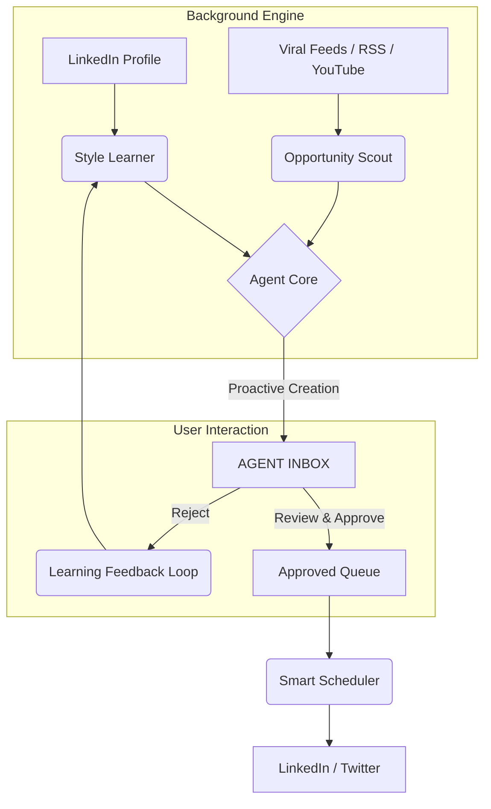

# Pixo: The Agentic Personal Branding Platform

> **Date:** Jan 22, 2026  
> **Mission:** Transform the manual 60-minute daily grind of personal branding into a 5-minute agentic "Review & Approve" workflow.

---

## 1. Vision & The Agentic Difference

Pixo is an **AI-agent-powered personal branding platform** for professionals on LinkedIn and Twitter/X. Unlike existing "toolbox" solutions (like Supergrow) that require users to initiate every action, Pixo's agents work autonomously in the background to create, curate, and schedule content.

### The Fundamental Paradigm Shift

| Feature Aspect | Manual-First (e.g., Supergrow) | Agent-First (Pixo) |
| :--- | :--- | :--- |
| **User Role** | **Manual Creator:** User searches, selects templates, and generates. | **Curator/Editor:** User reviews, edits, and approves agent-ready drafts. |
| **Workflow** | Open app → "What should I post?" → Tools → Publish. | Open app → "Here is what I prepared for you" → Review → Publish. |
| **Inspiration** | Manual search through billions of viral posts. | Proactive delivery of trending hooks tailored to your style. |
| **Style Setup** | Manual setup requiring users to paste writing samples. | Zero-touch auto-learning from your LinkedIn profile history. |
| **Effort** | **30-60 min/day** | **5-10 min/day** |

---

## 2. Background Agents Architecture

The core of Pixo is a suite of autonomous agents working 24/7 to maintain your authority.

---

## 3. Thorough Feature Analysis & Agentic Transformation

We have analyzed 14 core screens and features from the competitive landscape and mapped their agentic evolution for Pixo.

### A. The Creation Suite

#### 1. Post Generator & Templates
- **Supergrow Analysis:** A dashboard with gradient cards like "Share tips" or "Book learnings". Users click a card and fill in placeholders.
- **Pixo Agentic Evolution:** The agent **pre-fills** these templates. When you login, you don't see a blank "Share tips" template; you see a draft saying: *"I saw you were reading about {Topic} on LinkedIn, I used the 'Learning Insights' template to draft this for you."*

#### 2. Post Format Templates
- **Supergrow Analysis:** Uses structured formats with placeholders like `{topic}`, `{X}`, and `{highlight 1}`.
- **Pixo Agentic Evolution:** **Agentic Autocomplete.** Pixo pulls your history and bio to pre-fill placeholders like `{X}` and `{time}` automatically.

#### 3. PostCast (AI Interviewer)
- **Supergrow Analysis:** a 30-minute chat with "Alex" the AI to extract posts from a conversation.
- **Pixo Agentic Evolution:** **Proactive Listening.** Agent can monitor your public video appearances or linked voice memos and extrat multiple posts without a dedicated session.

#### 4. Content Style (BETA)
- **Supergrow Analysis:** Requires users to manually paste writing samples to mimic tone.
- **Pixo Agentic Evolution:** **Zero-Touch Profiling.** Automatically scrapes and analyzes your sent posts to update your "Style Profile" continuously.

---

### B. Inspiration & Curation

#### 5. Viral Posts Search & Swipe Files
- **Supergrow Analysis:** A searchable database where users manually save posts to folders or via a Chrome extension.
- **Pixo Agentic Evolution:** **The Opportunity Scout.** Instead of you searching for inspiration, the agent monitors your niche 24/7 and notifies you: *"This post about {Category} just crossed 5k reactions. I've already created your version in your style. [Review]"*

#### 6. Influencer Directory
- **Supergrow Analysis:** A categorized list of creators to browse for ideas.
- **Pixo Agentic Evolution:** **Smart Mentions.** Agent tracks these influencers and suggests: *"Building on what {Influencer} posted today about {Topic}, here's a relevant take for you to gain authority."*

#### 7. Repurposing (URL/PDF/YouTube/Voice)
- **Supergrow Analysis:** Manual process: Upload File → Choose Style → Generate.
- **Pixo Agentic Evolution:** **Automation Pipeline.** Connect your YouTube or Blog RSS, and Pixo auto-generates LinkedIn drafts for every new content piece detected.

---

### C. Distribution & Performance

#### 8. Kanban Board & Calendar
- **Supergrow Analysis:** Empty states requiring manual drag-and-drop to schedule.
- **Pixo Agentic Evolution:** **Auto-Populated Feed.** The workspace is already filled with agentic drafts. The calendar is managed by "Smart Autopilot" which slots posts into your peak engagement windows found by analytics.

#### 9. Analytics & LinkedIn Integration
- **Supergrow Analysis:** Shows growth and reactions. 2-step profile connection (URL → Confirm).
- **Pixo Agentic Evolution:** **Performance Loop.** *"Your 'lessons learned' posts get 3x more comments. I've adjusted your daily generation to prioritize this format."*

---

## 4. MVP Implementation Phases

### Phase 1: The Core Loop (Review & Approve)
- [ ] **Style Learner:** Backend service to extract writing DNA from LinkedIn history.
- [ ] **Viral Scanner:** Daily cron monitoring category trends and auto-generating versions.
- [ ] **Agent Inbox:** Primary UI where daily pre-generated drafts appear.
- [ ] **LinkedIn Sync:** 2-step profile import (Paste URL → extraction).

### Phase 2: Content Pipeline expansion
- [ ] **Auto-Repurposer:** Background YouTube/RSS monitoring.
- [ ] **Workspace:** Kanban management for approved drafts.
- [ ] **Smart Scheduling:** Basic optimal time suggestions based on analytics.

### Phase 3: Authority & Growth
- [ ] **PostCast Integration:** Voice-to-authority pipeline.
- [ ] **Influencer Watch:** Proactive suggestions to engage with trending creators.
- [ ] **Advanced Analytics:** Style evolution tracking and deep engagement insights.

---

## 5. Navigation Structure (Sidebar Map)

- **Inbox:** Agent's proactive feed (Home)
- **Drafts:** Kanban workspace for approved posts
- **Inspiration:** Viral pulse, Swipe files, and Influencer watch
- **Analytics:** Performance tracking and agent tuning
- **Settings:** LinkedIn/Twitter sync and Style profile
