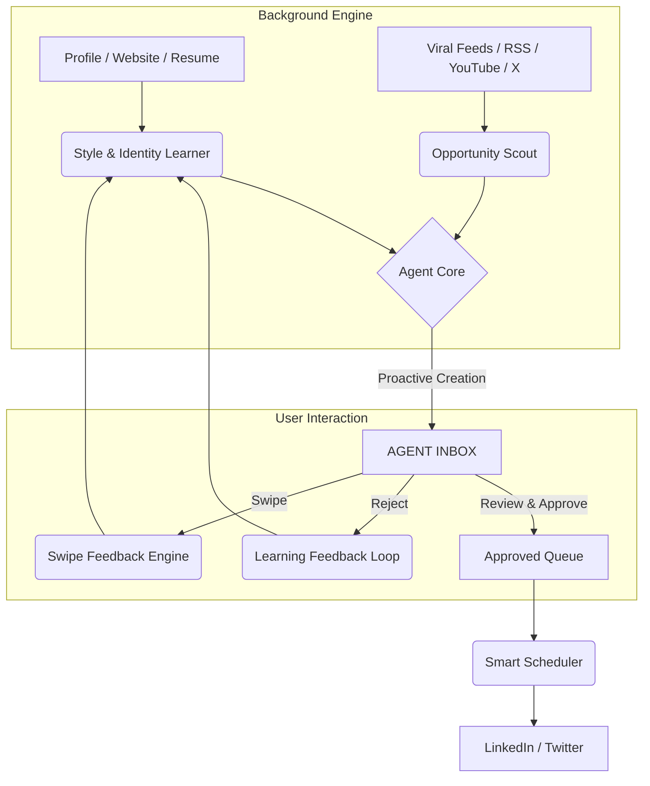

# Pixo: The Agentic Personal Branding Platform

> **Date:** Jan 22, 2026
> **Mission:** Transform the manual 60-minute daily grind of personal branding into a 5-minute agentic "Review & Approve" workflow.

---

## 1. Vision & The Agentic Difference

Pixo is an **AI-agent-powered personal branding and enterprise profile platform** for professionals, founders, and companies on LinkedIn and Twitter/X. Unlike existing "toolbox" solutions (like Supergrow) that require users to initiate every action, Pixo's agents work autonomously in the background to create, curate, and schedule content aligned with your identity.

Pixo starts with **text-first authority building** and expands to **images, carousels, and rich media**.

### The Fundamental Paradigm Shift

| Feature Aspect  | Manual-First (e.g., Supergrow)                                       | Agent-First (Pixo)                                                           |
| :-------------- | :------------------------------------------------------------------- | :--------------------------------------------------------------------------- |
| **User Role**   | **Manual Creator:** User searches, selects templates, and generates. | **Curator/Editor:** User reviews, edits, and approves agent-ready drafts.    |
| **Workflow**    | Open app → "What should I post?" → Tools → Publish.                  | Open app → "Here is what I prepared for you" → Review → Publish.             |
| **Inspiration** | Manual search through billions of viral posts.                       | Proactive delivery of trending hooks tailored to your style.                 |
| **Style Setup** | Manual setup requiring users to paste writing samples.               | Zero-touch auto-learning from profile, resume, website, and posting history. |
| **Effort**      | **30-60 min/day**                                                    | **5-10 min/day**                                                             |

---

## 2. Unified Profile Intelligence (NEW)

Pixo builds a **Unified Identity Graph** for both individuals and enterprises.

### Supported Inputs

* LinkedIn profile
* Personal website
* Resume / portfolio
* Long-form description (free text)
* Company website
* Company product pages
* Blog / content feeds

### Outcome

Pixo automatically constructs:

* Expertise map
* Narrative themes
* Authority angles
* Tone & positioning profile
* Audience relevance model

This enables **automatic tuning of content** to:

* Personal brands (founders, operators, creators)
* Enterprise brands (SaaS, agencies, B2B companies)

---

## 3. Background Agents Architecture

The core of Pixo is a suite of autonomous agents working 24/7 to maintain authority.

---

## 4. Swipe-Based Feedback System (NEW CORE FEATURE)

Pixo introduces a **Swipe UX for content curation**:

* Swipe Right → Approve & learn preference
* Swipe Left → Reject & reduce similar content
* Swipe Up → Edit & approve with feedback

This creates:

* Faster daily workflow
* Implicit preference learning
* Continuous style reinforcement

Swipe behavior becomes a **training signal** for:

* Topic preference
* Tone preference
* Post format preference
* Hook style preference

---

## 5. Thorough Feature Analysis & Agentic Transformation

### A. The Creation Suite

#### 1. Post Generator & Templates

* **Supergrow Analysis:** Manual card-based generation.
* **Pixo Agentic Evolution:** Agent pre-fills and delivers complete drafts in Inbox.

#### 2. Post Format Templates

* **Pixo Evolution:** Agentic Autocomplete using identity graph + history.

#### 3. PostCast (AI Interviewer)

* **Pixo Evolution:** Passive extraction from voice, video, and long-form content.

#### 4. Content Style

* **Pixo Evolution:** Zero-touch continuous profiling from live data sources.

---

### B. Inspiration & Curation

#### 5. Viral Posts Search & Swipe Files

* **Pixo Evolution:** Opportunity Scout + Auto-cloned drafts in your voice.

#### 6. Influencer Directory

* **Pixo Evolution:** Smart Mentions & proactive authority piggybacking.

#### 7. Repurposing (URL/PDF/YouTube/Voice)

* **Pixo Evolution:** Always-on automation pipeline.

---

### C. Distribution & Performance

#### 8. Kanban Board & Calendar

* **Pixo Evolution:** Auto-populated, agent-managed calendar.

#### 9. Analytics & Optimization Loop

* **Pixo Evolution:** Agent adjusts generation strategy based on engagement patterns.

---

## 6. Multimodal Expansion Roadmap (NEW)

Pixo begins text-first and expands to:

### Phase A: Images

* AI-generated visuals aligned to brand tone
* Image + text authority posts

### Phase B: Carousels

* Multi-slide educational & authority carousels
* Agent-generated outlines + slide copy

### Phase C: Rich Media

* Short-form video scripts
* Carousel → video repurposing

---

## 7. Enterprise Profiles (NEW)

Pixo supports **company and team-level branding**:

### Enterprise Capabilities

* Website + product understanding
* ICP-aware content
* Thought leadership for companies
* Founder + company voice alignment

### Use Cases

* SaaS founder authority
* B2B company content engine
* Agency brand positioning
* Hiring & employer branding

---

## 8. MVP Implementation Phases

### Phase 1: The Core Loop (Review & Approve)

* [ ] Style & Identity Learner (profile + website + resume)
* [ ] Viral Scanner
* [ ] Agent Inbox
* [ ] Swipe UX
* [ ] LinkedIn Sync

### Phase 2: Content Pipeline Expansion

* [ ] Auto-Repurposer (RSS / YouTube)
* [ ] Workspace (Kanban)
* [ ] Smart Scheduling

### Phase 3: Authority & Growth

* [ ] Voice & Long-form ingestion
* [ ] Influencer Watch
* [ ] Advanced Analytics

### Phase 4: Multimodal

* [ ] Image generation
* [ ] Carousel generation
* [ ] Rich media scripts

---

## 9. Navigation Structure (Sidebar Map)

* **Inbox:** Agent's proactive feed (Home)
* **Drafts:** Kanban workspace for approved posts
* **Inspiration:** Viral pulse & influencer watch
* **Media:** Images & carousels (future)
* **Analytics:** Performance & agent tuning
* **Profiles:** Personal & enterprise identity graphs
* **Settings:** Integrations & style profile

---

## 10. Core Differentiator Summary

Pixo is not a tool.

Pixo is an **always-on branding agent** that:

* Understands who you are
* Understands what you should talk about
* Understands how you should sound
* Delivers ready-to-post authority

From individuals to enterprises — Pixo becomes your autonomous personal branding system.
